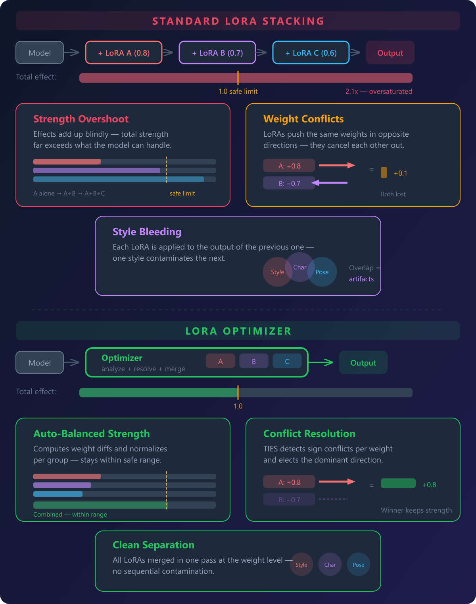
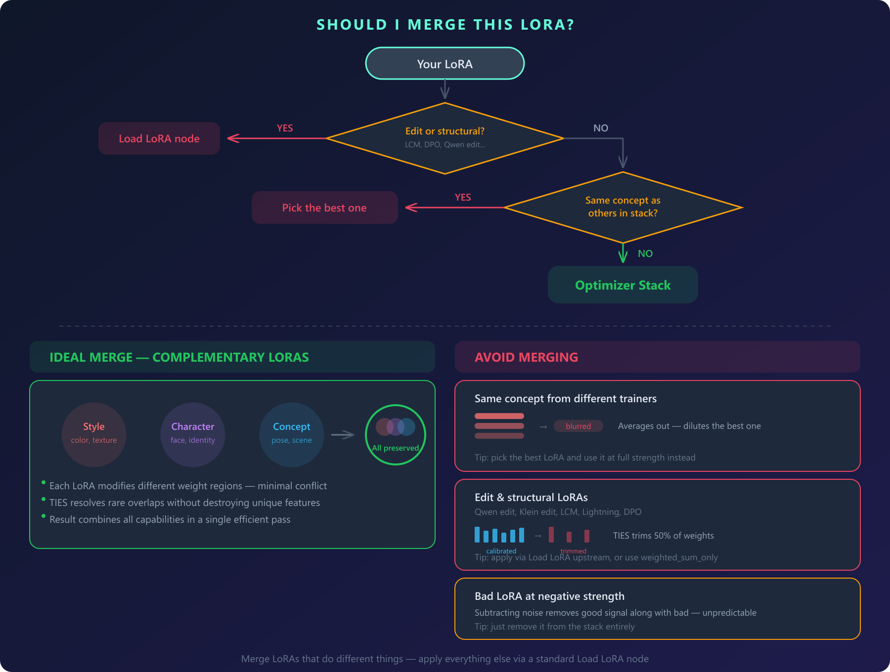
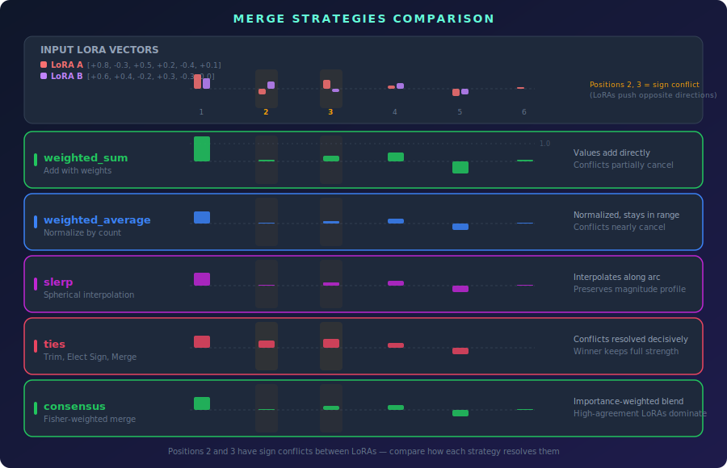
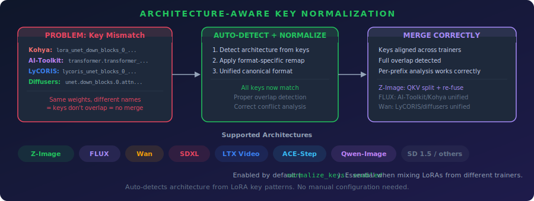
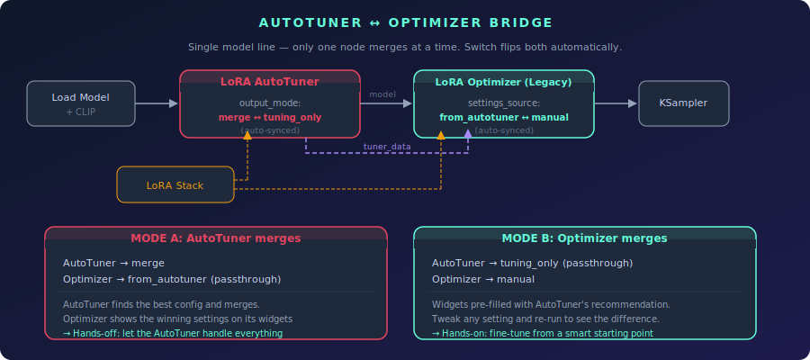
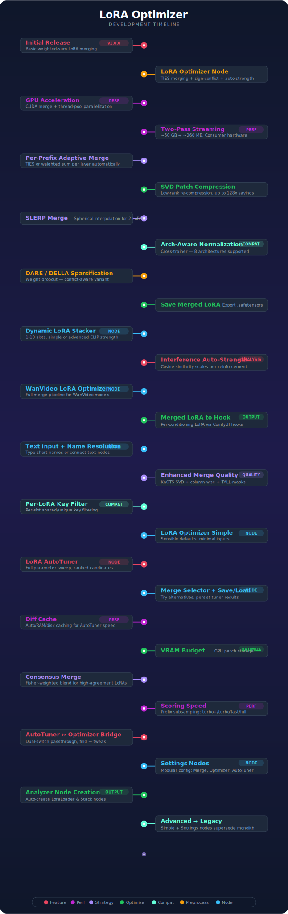

<p align="center">
  <a href="assets/banner.png"></a>
</p>

<p align="center">
  
  
  
  
  
  
  
  
  
  
</p>

---

A ComfyUI node suite that **automatically analyzes your LoRA stack** and selects the best merge strategy per weight group — diff-based merging, TIES conflict resolution, DARE/DELLA sparsification, per-prefix adaptive decisions, SVD patch compression, architecture-aware key normalization, enhanced merge quality (KnOTS alignment, column-wise voting, TALL-mask protection), and auto-tuned parameters. Core nodes: **LoRA Stack** (build input), **LoRA Optimizer** (analyze + merge), and **LoRA AutoTuner** (sweep all parameters automatically and find the best config).

## The Problem

<p align="center"></p>

<p align="center"></p>

---

<details>
<summary><b>Should I Merge This LoRA?</b></summary>

<p align="center"></p>

</details>

---

## Nodes

### LoRA Stack

Builds a list of LoRAs for the optimizer. Chain multiple Stack nodes to add any number of LoRAs.

**Inputs:** LoRA selector, strength, conflict_mode, key_filter, optional previous `LORA_STACK`

**Outputs:** `LORA_STACK`

---

### LoRA Stack (Dynamic)

Single node with adjustable slot count (1–10) — replaces chaining multiple Stack nodes.

| Mode | Behavior |
|------|----------|
| **Simple** | One `strength` slider per LoRA — clean and beginner-friendly |
| **Advanced** | Separate `model_strength` and `clip_strength`, plus `conflict_mode` and `key_filter` per LoRA |

Accepts an optional `lora_stack` input to chain with other Stack nodes.

**Outputs:** `LORA_STACK`

---

### LoRA Optimizer

The auto-optimizer. Takes a `LORA_STACK`, analyzes the LoRAs, and automatically selects the best merge mode and parameters **per weight group**. Outputs the merged result plus a detailed analysis report with a block strategy map. Available in two variants:

| Variant | Description |
|---------|-------------|
| **LoRA Optimizer** (Simple) | Sensible defaults — just model, stack, output strength, and optional CLIP. Auto-strength enabled. |
| **LoRA Optimizer (Advanced)** | Full control — sparsification, merge quality, SVD device, key normalization, and all other knobs. |

Also accepts standard tuple-format stacks `(lora_name, model_strength, clip_strength)` from Efficiency Nodes, Comfyroll, and similar packs.

Uses a **two-pass streaming architecture** for low memory usage:
- **Pass 1 (Analysis):** Computes weight diffs per prefix, samples conflict and magnitude statistics per prefix, then discards the diffs. Only lightweight scalars are kept.
- **Pass 2 (Merge):** Recomputes diffs per prefix, looks up that prefix's conflict data, picks the optimal strategy for it, and merges. Each prefix is freed after merging. Non-TIES patches are SVD-compressed to low-rank by default.

Peak memory is ~one prefix at a time (~260MB) regardless of LoRA count or model size. GPU-accelerated on both passes.

<p align="center"><a href="assets/optimizer-pipeline.png"></a></p>

<details>
<summary><b>What It Analyzes</b></summary>

- Per-LoRA metrics (rank, key count, effective L2 norms)
- Pairwise sign conflict ratios per prefix (sampled for efficiency)
- Pairwise cosine similarity (directional alignment between LoRAs)
- Magnitude distribution per prefix
- Key overlap between LoRAs

</details>

#### Per-Prefix Adaptive Merge

The key insight: two LoRAs may overlap in some model blocks but not others. A face LoRA and a style LoRA might only conflict in attention layers 4-7, while the rest of the model is touched by only one of them.

Instead of picking one global strategy (which either wastes TIES trimming on non-overlapping blocks or misses real conflicts), the optimizer decides **per weight prefix**:

<div align="center">

| Condition | Strategy |
|-----------|----------|
| Only 1 LoRA touches this prefix | `weighted_sum` — full strength, no dilution |
| 2+ LoRAs, sign conflict <= 25% | `weighted_average` — compatible, simple merge |
| 2+ LoRAs, sign conflict > 25% | `ties` — resolve conflicts with trim/elect/merge |
| Magnitude ratio > 2x at prefix | `total` sign method (stronger LoRA dominates) |
| Magnitude ratio <= 2x at prefix | `frequency` sign method (equal votes) |

</div>

This means non-overlapping regions keep 100% of their LoRA's effect, while genuinely conflicting regions get proper TIES resolution.

<p align="center"><a href="assets/merge-strategies.png"></a></p>

<details>
<summary><b>TIES Merging</b></summary>

The optimizer automatically selects TIES-Merging (Trim, Elect Sign, Disjoint Merge — [Yadav et al., NeurIPS 2023](https://arxiv.org/abs/2306.01708)) on prefixes where sign conflicts are detected between LoRAs.

<p align="center"><a href="assets/ties-diagram.png"></a></p>

</details>

<details>
<summary><b>DARE / DELLA Sparsification</b></summary>

DARE and DELLA **sparsify each LoRA's diff before merging**, reducing parameter interference between LoRAs. Available in two modes: **standard** (drops weights everywhere) and **conflict-aware** (only drops weights where LoRAs actually interfere).

<p align="center"><a href="assets/sparsification-diagram.png"></a></p>

| Method | How It Works |
|--------|-------------|
| **DARE** | Bernoulli random mask at given density. Survivors rescaled by 1/density to preserve expected value. Fast and unbiased. |
| **DELLA** | Per-row magnitude ranking. Low-magnitude elements get higher drop probability, high-magnitude elements are kept. More surgical than DARE. |
| **DARE (conflict-aware)** | Same as DARE, but only applied at positions where 2+ LoRAs push in **opposite directions**. Same-sign positions (where LoRAs reinforce each other) are left untouched. |
| **DELLA (conflict-aware)** | Same as DELLA, but only at conflict positions. Unique contributions from each LoRA are fully preserved. |

**Why conflict-aware?** Standard sparsification drops weights everywhere — including positions where only one LoRA contributes, or where multiple LoRAs agree. This destroys useful signal. Conflict-aware variants compute a **sign-conflict mask** first: positions where LoRAs push in opposite directions (actual interference). Only those positions get sparsified. The result: interference is reduced without sacrificing unique features.

**Interaction with merge strategies:**
- **TIES mode:** DARE/DELLA *replaces* the TIES trim step (both achieve sparsification, no need for both)
- **Other modes:** Applied as preprocessing before the merge operation

| Setting | Default | Options |
|---------|---------|---------|
| `sparsification` | disabled | `disabled`, `dare`, `della`, `dare_conflict`, `della_conflict` |
| `sparsification_density` | 0.7 | Fraction of parameters to keep (lower = more aggressive) |

</details>

<details>
<summary><b>Merge Quality (Enhanced / Maximum)</b></summary>

Three quality levels for merge conflict resolution, selectable via the `merge_quality` dropdown:

<p align="center"><a href="assets/merge-quality-diagram.png"></a></p>

| Level | What It Adds | Cost |
|-------|-------------|------|
| **standard** (default) | Current behavior — element-wise sign voting and merge | Baseline |
| **enhanced** | Column-wise conflict resolution + TALL-mask selfish weight protection | Minimal extra compute, no extra VRAM |
| **maximum** | KnOTS SVD alignment + column-wise + TALL-masks | More VRAM for SVD decomposition |

**Column-wise conflict resolution** (enhanced+): Instead of each weight position voting independently on sign direction, entire output neurons (rows) vote as a unit. This preserves structural coherence — a neuron's weights work together, so their signs should be resolved together.

**TALL-masks** (enhanced+): Identifies "selfish" weights — positions where one LoRA dominates and others contribute little. These weights are separated from the consensus merge and added back afterward, protecting each LoRA's unique features from being averaged away.

**KnOTS SVD alignment** (maximum): Projects all LoRA diffs into a shared singular value basis via truncated SVD before merging. This makes diffs more directly comparable by aligning their representation spaces. Falls back to CPU on GPU OOM, skips gracefully if both fail.

**Interaction with other settings:**
- Works with all merge modes (TIES, weighted_average, SLERP, etc.)
- Combines with DARE/DELLA sparsification — sparsification runs first, then quality enhancements
- Best combination: `maximum` + `della_conflict` (or `dare_conflict`) for full pipeline
- Single-LoRA prefixes: all enhancements short-circuit (no work to do)

| Setting | Default | Options |
|---------|---------|---------|
| `merge_quality` | standard | `standard`, `enhanced`, `maximum` |

</details>

<details>
<summary><b>Key Filter</b></summary>

<a name="key-filter"></a>

Each LoRA has a per-LoRA `key_filter` setting (available on both **LoRA Stack** and **LoRA Stack (Dynamic)** in advanced mode) that controls which key prefixes that LoRA contributes to, based on how many LoRAs in the stack share each prefix:

| Filter | Behavior | Use Case |
|--------|----------|----------|
| `all` (default) | Contribute to all keys | Normal merging |
| `shared_only` | Only contribute to keys present in 2+ LoRAs | Strip variant-specific keys (I2V/VACE) from this LoRA |
| `unique_only` | Only contribute to keys present in exactly 1 LoRA | Extract only the variant-specific adapter keys from this LoRA |

This is especially useful for Wan T2V/I2V/VACE LoRAs, which share ~90% of weights but each variant has unique keys (I2V: `cross_attn.k_img/v_img`, `img_emb`; VACE: `vace_blocks.*`, `vace_patch_embedding`).

Because the filter is per-LoRA, you can apply different filters to different LoRAs in the same stack — e.g., "take only the unique VACE keys from LoRA #2 while merging all keys from LoRA #1".

**Example — making an I2V LoRA T2V-compatible:**
1. Stack a T2V LoRA + an I2V LoRA together
2. Set the I2V LoRA's `key_filter` to `shared_only`
3. The I2V-only keys (`k_img`, `v_img`, `img_emb`, etc.) are skipped for that LoRA since they appear in only 1 LoRA
4. The merged result contains only the shared T2V-compatible weights

**Example — extracting a lightweight I2V adapter:**
1. Same stack (T2V + I2V)
2. Set the I2V LoRA's `key_filter` to `unique_only`
3. Only the I2V-specific keys are contributed by that LoRA — a small adapter with just the variant-specific weights

The filter uses the raw `n_loras` count from Pass 1 (before any filtering) and is applied per-LoRA during Pass 2 merge.

</details>

<details>
<summary><b>Auto-Strength</b></summary>

When `auto_strength` is set to `enabled`, the optimizer automatically reduces per-LoRA strengths before merging to prevent overexposure from stacking. This is especially useful on distilled/turbo models where 2+ LoRAs at full strength cause blown-out results even with optimal merge mode selection.

The algorithm uses **interference-aware energy normalization**: it measures pairwise cosine similarity between LoRAs during analysis to account for directional alignment, then computes the exact vector-sum energy using the formula `||sum(v_i)||^2 = sum(||v_i||^2) + 2 * sum(||v_i|| * ||v_j|| * cos(v_i, v_j))`. All strengths are scaled so the total combined energy matches what the strongest single LoRA would contribute alone.

- **Aligned LoRAs** (cos~1) — stronger reduction (they reinforce each other, so combined energy is high)
- **Orthogonal LoRAs** (cos~0) — moderate reduction (independent contributions add in quadrature)
- **Opposing LoRAs** (cos~-1) — minimal reduction (they cancel out, so combined energy is low)

| Scenario | Result |
|----------|--------|
| 2 aligned LoRAs (cos~1) at strength 1.0 | Each reduced to ~0.50 |
| 2 orthogonal LoRAs (cos~0) at strength 1.0 | Each reduced to ~0.71 |
| 2 opposing LoRAs (cos~-1) at strength 1.0 | ~1.0 each (they cancel) |
| 1 strong + 1 weak LoRA | Proportional reduction |
| Single LoRA | No change |
| `auto_strength` disabled | No adjustment (default) |

Your original strength ratios are always preserved — the algorithm only scales them down uniformly.

</details>

<details>
<summary><b>Architecture-Aware Key Normalization</b></summary>

Different LoRA trainers (Kohya, AI-Toolkit, LyCORIS, diffusers/PEFT) produce LoRAs with **different key naming conventions** for the same model weights. When mixing LoRAs from different trainers, the optimizer sees no key overlap and cannot merge them correctly.

Key normalization auto-detects the model architecture from LoRA key patterns and remaps all keys to a canonical format, enabling correct overlap detection and conflict analysis across trainer formats.

<p align="center"><a href="assets/key-normalization.png"></a></p>

| Architecture | Detected From | Normalization |
|-------------|--------------|---------------|
| **Z-Image** (Lumina2) | `diffusion_model.layers.N.attention`, `single_transformer_blocks` | Prefix standardization, QKV split for per-component analysis, re-fuse after merge |
| **FLUX** | `double_blocks`/`single_blocks`, `transformer.transformer_blocks` | AI-Toolkit / Kohya / diffusers unified to canonical format |
| **Wan** 2.1/2.2 | `blocks.N` with `self_attn`/`cross_attn`/`ffn` | LyCORIS / diffusers / Musubi Tuner unified, RS-LoRA alpha fix |
| **SDXL** | `lora_te1_`/`lora_te2_`, `input_blocks`/`down_blocks` | Text encoder + UNet key unification |
| **LTX Video** | `adaln_single`, `transformer_blocks` with `attn1`/`attn2` | Trainer format unification |
| **ACE-Step** | `layers.N` with `self_attn`/`cross_attn` and `q_proj`/`k_proj`/`v_proj` | Attention key unification |
| **Qwen-Image** | `transformer_blocks` with `img_mlp`/`txt_mlp`/`img_mod`/`txt_mod` | Dual-stream key unification |

**Z-Image QKV handling:** Z-Image LoRAs often fuse Q, K, V projections into a single `attention.qkv` weight. The normalizer splits these into separate `to_q`/`to_k`/`to_v` components for per-component conflict analysis, then **re-fuses** them back to the native format after merging.

| Setting | Default | Effect |
|---------|---------|--------|
| `normalize_keys` | enabled | `disabled` or `enabled`. Recommended — makes LoRAs from different trainers compatible and enables Z-Image QKV splitting. |

</details>

<details>
<summary><b>Architecture-Aware Behavior Profiles</b></summary>

All numeric thresholds in the optimizer (density estimation, conflict detection, auto-strength scaling, scoring heuristics) are tuned per architecture family. The `architecture_preset` setting selects the appropriate thresholds — `auto` detects from LoRA key patterns.

| Preset | Architectures | Key Differences |
|--------|--------------|-----------------|
| `sd_unet` | SD 1.5, SDXL | Density range [0.1, 0.9], noise floor 10%, max strength cap 3.0 |
| `dit` | Flux, WAN, Z-Image, LTX, HunyuanVideo | Density range [0.4, 0.95], noise floor 5%, max strength cap 5.0 |
| `llm` | Qwen-Image, LLaMA-based | Density range [0.1, 0.8], noise floor 15%, max strength cap 3.0 |

**Why it matters:** DiT architectures have denser weight distributions than UNet — with UNet thresholds, the optimizer underestimates density and clips suggested strength too aggressively. LLM-based models are sparser and benefit from lower density ceilings.

| Setting | Default | Options |
|---------|---------|---------|
| `architecture_preset` | auto | `auto`, `sd_unet`, `dit`, `llm`. Auto-detection uses the same key pattern matching as key normalization |

**Note:** This is orthogonal to `behavior_profile` (which controls *strategy features* like consensus mode and SLERP upgrade). Architecture preset controls the *numeric thresholds* those strategies use.

</details>

<details>
<summary><b>SVD Patch Compression</b></summary>

After merging, full-rank diff patches consume ~128x more RAM than standard LoRA patches (64MB vs 0.5MB per key for a 4096x4096 weight). The optimizer re-compresses merged patches to low-rank via truncated SVD, dramatically reducing post-merge RAM.

| Mode | What gets compressed | Quality | RAM savings |
|------|---------------------|---------|-------------|
| `non_ties` (default) | `weighted_sum` and `weighted_average` prefixes only | Lossless — sum of input ranks preserves all merge information | ~32x on compressed prefixes |
| `all` | Everything including TIES | Lossy on TIES prefixes — nonlinear ops (trim, sign election) produce full-rank results that can't be perfectly captured | ~32x on all prefixes |
| `disabled` | Nothing | No loss | No savings |

The compression rank is automatically computed as the sum of all input LoRA ranks. For example, 3 rank-32 LoRAs produce a rank-96 compressed patch — enough to represent the full merge without quality loss on linear operations.

> **Tip:** For video models (LTX, Wan, etc.) with high RAM usage, use `weighted_sum_only` + `non_ties` (or `all`). Every patch gets losslessly compressed with minimal RAM footprint.

</details>

<details>
<summary><b>Optimization Modes</b></summary>

| Mode | Behavior |
|------|----------|
| `per_prefix` (default) | Each weight group picks its own strategy based on local conflict data |
| `global` | Single strategy for all prefixes (original behavior) |
| `weighted_sum_only` | Forces simple weighted sum everywhere — no TIES, no averaging. Combined with patch compression, all patches are fully compressible with zero quality loss |

</details>

<details>
<summary><b>Block Strategy Map</b></summary>

The analysis report includes a visual block-by-block map showing what strategy was used and why:

```
--- Block Strategy Map ---
  input_blocks.0   ====  sum  1 LoRA (6x)
  input_blocks.4   ----  avg  12% conflict (6x)
  middle_block.1   ####  TIES 42% conflict (6x)
  output_blocks.3  ----  avg  8% conflict (6x)
  output_blocks.8  ====  sum  1 LoRA (6x)
  Legend: ==== sum (single LoRA)  ---- avg (compatible)  #### TIES (conflict)
```

</details>

<details>
<summary><b>Memory Options</b></summary>

| Option | Default | Effect |
|--------|---------|--------|
| `cache_patches` | enabled | Cache merged patches in RAM for faster re-execution. Disable to free RAM after merge (recommended for video models) |
| `compress_patches` | non_ties | SVD re-compression of merged patches (see above) |
| `svd_device` | gpu | Device for SVD compression. GPU is ~10-50x faster than CPU. Use CPU if GPU memory is tight |
| `free_vram_between_passes` | disabled | Release GPU cache between analysis and merge passes. Lowers peak VRAM at negligible speed cost |

</details>

#### Inputs / Outputs

**Inputs (Advanced):** `MODEL`, `CLIP` (optional), `LORA_STACK`, output strength, clip strength multiplier, auto strength, optimization mode, merge quality, behavior profile, architecture preset, cache patches, compress patches, SVD device, free VRAM between passes, normalize keys, sparsification, sparsification density, DARE dampening, `TUNER_DATA` (optional — for bridge workflow), settings_source.

**Outputs:** `MODEL`, `CLIP`, `STRING` (analysis report), `LORA_DATA` (for Save Merged LoRA / Merged LoRA to Hook)

<details>
<summary><b>Example Report</b></summary>

```
==================================================
LORA OPTIMIZER - ANALYSIS REPORT
==================================================
Architecture preset: sd_unet (SD/SDXL UNet)

--- Per-LoRA Analysis ---
  style_lora.safetensors:
    Strength: 1.0
    Keys: 192
    Avg rank: 64
    L2 norm (mean): 0.0847
  detail_lora.safetensors:
    Strength: 0.8
    Keys: 192
    Avg rank: 32
    L2 norm (mean): 0.0423

--- Auto-Strength Adjustment ---
  style_lora.safetensors: 1.0 -> 0.6345
  detail_lora.safetensors: 0.8 -> 0.5076
  Scale factor: 0.6345
  Method: interference-aware energy normalization
    Avg pairwise cosine similarity: 0.312 (mostly aligned (reinforcing))
    Interference-aware energy: 0.1335 (orthogonal assumption: 0.1196)

--- Pairwise Analysis ---
  style_lora.safetensors vs detail_lora.safetensors:
    Overlapping positions: 89420
    Sign conflicts: 31297 (35.0%)
    Cosine similarity: 0.312

--- Collection Statistics ---
  Total LoRAs: 2
  Total unique keys: 196
  Avg sign conflict ratio: 35.0%
  Magnitude ratio (max/min L2): 2.00x

--- Auto-Selected Parameters ---
  Merge mode: ties
  Density: 0.42
  Sign method: frequency
  Sparsification: DARE
  Sparsification density: 0.70 (keep rate)
  For TIES prefixes: replaces trim step; others: preprocessing
  (global fallback — each prefix uses its own parameters)

--- Per-Prefix Strategy ---
  weighted_sum (single LoRA):        28 prefixes (14%)
  weighted_average (low conflict):  120 prefixes (61%)
  ties (high conflict):              48 prefixes (24%)
  Total:                            196 prefixes

--- Block Strategy Map ---
  input_blocks.0   ====  sum  1 LoRA (6x)
  input_blocks.1   ====  sum  1 LoRA (6x)
  input_blocks.4   ----  avg  12% conflict (6x)
  input_blocks.5   ####  TIES 38% conflict (6x)
  middle_block.1   ####  TIES 42% conflict (6x)
  output_blocks.3  ----  avg  15% conflict (6x)
  output_blocks.8  ====  sum  1 LoRA (6x)
  Legend: ==== sum (single LoRA)  ---- avg (compatible)  #### TIES (conflict)

--- Reasoning ---
  Sign conflict ratio 35.0% > 25% threshold -> TIES mode selected
    TIES resolves sign conflicts via trim + elect sign + disjoint merge
  Auto-density estimated at 0.42 from magnitude distribution
  Magnitude ratio 2.00x <= 2x -> 'frequency' sign method (equal voting)
    Similar-strength LoRAs get equal votes

--- Merge Summary ---
  Keys processed: 196
  Model patches: 168
  CLIP patches: 28
  Output strength: 1.0
  CLIP strength: 1.0

==================================================
```

Connect the `STRING` output to a **Show Text** node to see the report in ComfyUI.

</details>

<details>
<summary><b>Important notes & limitations</b></summary>

> **Structural & Edit LoRAs:** Do not put distillation LoRAs (LCM, Lightning, Turbo, Hyper), DPO LoRAs, or **edit model LoRAs** (Qwen edit, Klein edit, instruction-editing LoRAs) in the optimizer stack. These LoRAs modify the model's fundamental behavior — their weights are precisely calibrated and merging them with style LoRAs can break their training. Apply them via a standard **Load LoRA** node upstream, then feed only your style/character LoRAs into the optimizer. If you must include an edit LoRA in the stack, use `weighted_sum_only` mode and disable sparsification to avoid weight trimming.

> **Limitation:** The optimizer only analyzes LoRAs in its own stack. It cannot see LoRA patches applied by upstream nodes (Load LoRA, etc.) — those stack additively on top of the optimizer's output. Fully baked merges (safetensors checkpoints) are indistinguishable from base weights and cannot be detected.

</details>

---

### LoRA AutoTuner

Automatically sweeps all merge parameters (mode, sparsification, density, dampening, quality level) and finds the best configuration for your LoRA stack. Runs Pass 1 analysis once, scores all parameter combinations via heuristic, then merges the top-N candidates and measures output quality. Outputs the best merge directly as `MODEL`/`CLIP`, plus a ranked report and `TUNER_DATA` for exploring alternatives via a **Merge Selector** node or fine-tuning via the **AutoTuner → Optimizer Bridge**.

**Inputs:** `MODEL`, `LORA_STACK`, output strength, optional `CLIP`, top_n, normalize_keys, scoring_svd, scoring_speed, architecture_preset, diff_cache_mode, vram_budget, output_mode.

**Outputs:** `MODEL`, `CLIP`, `STRING` (ranked report), `STRING` (analysis report), `TUNER_DATA` (for Merge Selector / Optimizer Bridge / Save Tuner Data), `LORA_DATA` (for Save Merged LoRA)

<details>
<summary><b>Scoring Speed</b></summary>

Controls how many prefixes Phase 2 scores per candidate. All candidates are scored on the same subset so ranking stays fair. High-conflict prefixes are prioritized when subsampling.

| Speed | Prefixes scored | Best for |
|-------|----------------|----------|
| `full` | Every prefix | Very different LoRA combinations (style + character + concept) |
| `fast` | Every 2nd (~50% faster) | Higher accuracy than turbo, still much faster than full |
| `turbo` (default) | Every 3rd (~67% faster) | LoRAs with similar conflict patterns |
| `turbo+` | Every 4th (~75% faster) | Large models (Flux/WAN) or quick iteration |

</details>

<details>
<summary><b>Output Mode</b></summary>

| Mode | Behavior |
|------|----------|
| `merge` (default) | Full sweep + final merge — outputs the best merged model |
| `tuning_only` | Full sweep but skips the final merge — outputs the base model unchanged. Use when chaining with a downstream LoRA Optimizer via the bridge workflow |

In `tuning_only` mode, `TUNER_DATA` still contains the full ranked results. Switching between modes is instant when cache is enabled — the sweep results are reused.

</details>

<details>
<summary><b>Diff Cache</b></summary>

During the parameter sweep, each candidate recomputes raw LoRA diffs (A@B matmul) from scratch — even though diffs depend only on LoRA content, not merge config. The diff cache stores these diffs after the first candidate and reuses them for subsequent candidates, eliminating redundant computation.

| Mode | Behavior |
|------|----------|
| `disabled` | Recomputes diffs each time. No extra memory |
| `auto` (default) | Uses RAM up to `diff_cache_ram_pct` of free memory, then spills to disk. Recommended for most setups |
| `ram` | All diffs in RAM. Fastest, but uses ~1.5 GB (SDXL) to ~6 GB (Flux) |
| `disk` | All diffs to temp files with memory-mapping. Slowest cache mode, but minimal RAM |

When `auto` mode runs out of disk space, it falls back to RAM automatically.

| Setting | Default | Effect |
|---------|---------|--------|
| `diff_cache_mode` | auto | Cache mode selection |
| `diff_cache_ram_pct` | 0.5 | Fraction of free system RAM for `auto` mode (0.1–0.9) |

</details>

<details>
<summary><b>VRAM Budget</b></summary>

The `vram_budget` slider (0.0–1.0) controls what fraction of free VRAM to use for storing merged patches on GPU. Default is 0 (all patches on CPU). Setting it higher keeps patches on GPU, reducing RAM usage on systems with enough VRAM. Available on both LoRA Optimizer and LoRA AutoTuner.

</details>

---

### Merge Selector

Applies a specific configuration from AutoTuner results without re-running the sweep. Connect `TUNER_DATA` from a LoRA AutoTuner (or Load Tuner Data) node and set the `selection` index to choose which ranked configuration to apply (1 = best, 2 = second best, etc.).

**Inputs:** `MODEL`, `LORA_STACK`, `TUNER_DATA`, selection (1–10), output strength, optional `CLIP`, vram_budget.

**Outputs:** `MODEL`, `CLIP`, `STRING` (report), `LORA_DATA`

**Workflow:**
```
LoRA AutoTuner → TUNER_DATA → Merge Selector (selection=2) → try the 2nd-best config
                      ↓
              Save Tuner Data → (reload later) → Load Tuner Data → Merge Selector
```

---

### AutoTuner → Optimizer Bridge

Chain the AutoTuner and Optimizer in a **single model line** for a "find best, then tweak" workflow. Only one node merges at a time — the other passes the model through. A single switch controls which is active, and the two nodes stay in sync automatically.

<p align="center">
  
</p>

```
[Load Model] → [AutoTuner] → model → [Optimizer] → MODEL → sampler
[LoRA Stack]  → [AutoTuner]
[LoRA Stack]  → [Optimizer]
               [AutoTuner] → tuner_data → [Optimizer]
```

| Optimizer `settings_source` | AutoTuner `output_mode` | What happens |
|----|----|----|
| `from_autotuner` | `merge` (auto-synced) | AutoTuner merges → Optimizer passes through. Optimizer widgets show the winning config. |
| `manual` | `tuning_only` (auto-synced) | AutoTuner passes base model through → Optimizer merges with its widget settings. |

**Typical flow:**
1. Start with `from_autotuner` — let the AutoTuner find the best config
2. Inspect the Optimizer's widgets to see what won
3. Switch to `manual` — the Optimizer takes over, starting from the AutoTuner's recommendation
4. Tweak settings (merge_quality, sparsification, etc.) and re-run

Switching between modes is instant — the AutoTuner reuses its cached sweep results.

---

<details>
<summary><b>Save / Load Tuner Data</b></summary>

Two utility nodes for persisting AutoTuner results to disk:

**Save Tuner Data** — Saves `TUNER_DATA` as a JSON file. Plain filename saves to `models/tuner_data/`, absolute path saves to that location. `OUTPUT_NODE = True`.

**Load Tuner Data** — Dropdown of saved tuner data files. Outputs `TUNER_DATA` ready for Merge Selector. Auto-reloads when the file changes on disk.

</details>

---

<details>
<summary><b>Save Merged LoRA</b></summary>

Saves the optimizer's merged result as a standalone `.safetensors` file that works with any standard LoRA loader.

Connect the `LORA_DATA` output from LoRA Optimizer to this node.

| Option | Default | Effect |
|--------|---------|--------|
| `filename` | `merged_lora` | Plain name saves to your ComfyUI loras folder. Absolute path (e.g. `/path/to/my_lora`) saves to that location |
| `save_rank` | 0 (auto) | 0 = use each layer's existing rank from the merge. Non-zero = force this rank for layers that need compression |
| `bake_strength` | enabled | When on, the saved LoRA reproduces your exact merge at strength 1.0. When off, strengths are not baked in |

**Outputs:** `STRING` (file path)

</details>

---

<details>
<summary><b>Merged LoRA to Hook</b></summary>

Wraps the optimizer's merged patches as a **conditioning hook** (`HOOKS`) for per-conditioning LoRA application. Instead of applying the merged LoRA globally to the model, you can attach it to specific conditioning entries using ComfyUI's hook system.

Connect the `LORA_DATA` output from LoRA Optimizer to this node, then connect the `HOOKS` output to a **Cond Set Props** (or similar) node.

**Inputs:** `LORA_DATA` (required), `HOOKS` (optional — chain with existing hooks)

**Outputs:** `HOOKS`

Use this node when you want the merged LoRA to apply **only to specific conditioning** rather than the entire model:

- **Per-prompt LoRA:** Apply different merged LoRAs to positive vs negative conditioning
- **Scheduled application:** Combine with hook keyframes to apply the LoRA only during certain sampling steps
- **Regional conditioning:** Use with area-based conditioning to apply the LoRA to specific image regions
- **Preserving the base model:** Keep the MODEL output clean (unpatched) while still using the merged LoRA through conditioning hooks

**Workflow example:**
```
Load Checkpoint → MODEL ──┬──→ LoRA Optimizer → LORA_DATA → Merged LoRA to Hook → HOOKS
                           │                                                          ↓
                           └──→ KSampler ←──── Conditioning ←──── Cond Set Props
```

The `prev_hooks` input allows chaining multiple hook sources together.

</details>

---

<details>
<summary><b>WanVideo LoRA Optimizer</b></summary>

Variant of the LoRA Optimizer for **WanVideo models** (via [kijai's WanVideoWrapper](https://github.com/kijai/ComfyUI-WanVideoWrapper)). Accepts `WANVIDEOMODEL` instead of `MODEL`, skips CLIP, and applies merged patches in-memory.

All merging algorithms are inherited — TIES, DARE/DELLA, SVD compression, auto-strength, per-prefix adaptive merge, merge quality enhancements (KnOTS, column-wise, TALL-masks), and Wan key normalization (LyCORIS, diffusers, Fun LoRA, finetrainer, RS-LoRA) all work identically.

**Inputs:** `WANVIDEOMODEL`, `LORA_STACK`, output strength, and all optimizer options (except CLIP-related ones). Defaults: `normalize_keys=enabled`, `cache_patches=disabled`.

**Outputs:** `WANVIDEOMODEL` (patched), `STRING` (analysis report), `LORA_DATA` (for Save Merged LoRA)

**Basic workflow:**
```
WanVideoModelLoader → WANVIDEOMODEL → WanVideo LoRA Optimizer → WANVIDEOMODEL → WanVideoSampler
                                               ↑
                        LoRA Stack ─────────────┘
```

**Chaining with individual LoRAs:** Individual (non-merged) LoRAs go through WanVideoLoraSelect → model loader as usual. Our optimizer applies merged LoRAs on top — both coexist in the model patcher.

```
WanVideoLoraSelect → WanVideoModelLoader → WANVIDEOMODEL → WanVideo LoRA Optimizer → Sampler
                                                                    ↑
                                             LoRA Stack ────────────┘
```

**Key defaults differ from the standard optimizer:**
- `normalize_keys` = **enabled** — WanVideo LoRAs come from many trainers, normalization is commonly needed
- `cache_patches` = **disabled** — video models are large, caching uses significant RAM
- `architecture_preset` = **dit** — DiT-tuned thresholds (higher density floor, wider strength range)

</details>

---

## Installation

### ComfyUI Manager
Search for "LoRA Optimizer" in ComfyUI Manager and install.

<details>
<summary><b>Manual install</b></summary>

```bash
cd ComfyUI/custom_nodes/
git clone https://github.com/ethanfel/ComfyUI-LoRA-Optimizer.git
```
Restart ComfyUI. Nodes appear under the `loaders` category.

</details>

<details>
<summary><b>Compatibility</b></summary>

- **Models:** SD 1.5, SDXL, Flux, Z-Image (Lumina2), Wan 2.1/2.2, LTX Video, ACE-Step, Qwen-Image, and other architectures supported by ComfyUI
- **LoRA formats:** Standard LoRA, LoCon, LyCORIS, diffusers/PEFT formats
- **Trainers:** Kohya, AI-Toolkit, LyCORIS, Musubi Tuner, diffusers — auto-normalized when `normalize_keys` is enabled
- **Flux sliced weights:** Handled correctly (linear1_qkv offsets)
- **Z-Image fused QKV:** Split for per-component analysis, re-fused after merge
- **Stack formats:** Native LoRA Stack dicts, plus standard tuples from Efficiency Nodes / Comfyroll

</details>

<details>
<summary><b>Credits</b></summary>

- Originally based on [ComfyUI-ZImage-LoRA-Merger](https://github.com/DanrisiUA/ComfyUI-ZImage-LoRA-Merger) by DanrisiUA
- Per-prefix adaptive approach inspired by [comfyUI-Realtime-Lora](https://github.com/shootthesound/comfyUI-Realtime-Lora) by shootthesound (per-block LoRA analysis)
- Thanks to Scruffy and Ramonguthrie for suggesting the per-block analysis approach
- TIES-Merging: [Yadav et al., NeurIPS 2023](https://arxiv.org/abs/2306.01708)
- DARE: [Yu et al., ICML 2024](https://arxiv.org/abs/2311.03099) — Drop And REscale for language model merging
- DELLA: [Deep et al., 2024](https://arxiv.org/abs/2406.11617) — magnitude-aware sparsification
- KnOTS: [Ramé et al., 2024](https://arxiv.org/abs/2407.09095) — SVD alignment for model merging
- TALL-masks: [Wang et al., 2024](https://arxiv.org/abs/2406.12832) — selfish weight protection via task-aware masks
- Column-wise merging inspired by ZipLoRA: [Shah et al., 2025](https://arxiv.org/abs/2311.13600) — structural sparsity for LoRA merging

</details>

<details>
<summary><b>Development Timeline</b></summary>

<p align="center"><a href="assets/timeline.png"></a></p>

</details>

## License

MIT License - see [LICENSE](LICENSE).
