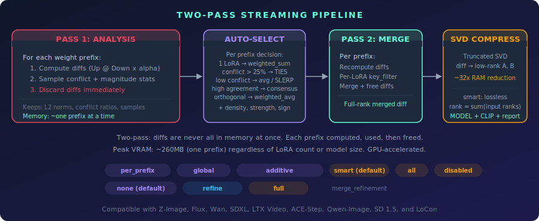
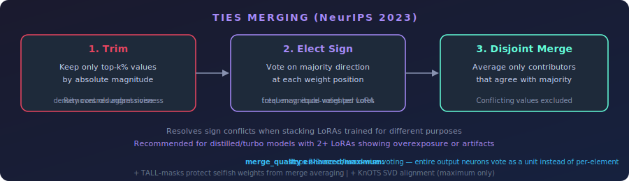

<p align="center">
  
</p>

<p align="center">
  
  
  
  
  
</p>

---

A ComfyUI node that **automatically analyzes your LoRA stack** and selects the best merge strategy per weight group — diff-based merging, TIES conflict resolution, per-prefix adaptive decisions, and auto-tuned parameters. Two nodes: **LoRA Stack** (build input) and **LoRA Optimizer** (analyze + merge).

## The Problem

Stacking LoRAs in ComfyUI adds their effects together. On distilled/turbo models (SDXL-Turbo, LCM, Lightning, Flux-schnell), the accumulated effect exceeds what the model can handle, causing **overexposure, color blowout, and artifacts**.

```
model += lora1_effect x strength1
model += lora2_effect x strength2
total effect = strength1 + strength2  -->  easily exceeds 1.0
```

The optimizer solves this by computing full weight diffs, detecting sign conflicts per weight group, and merging each group with its optimal strategy.

<p align="center">
  
</p>

## Nodes

### LoRA Stack

Builds a list of LoRAs for the optimizer. Chain multiple Stack nodes to add any number of LoRAs.

**Inputs:** LoRA selector, strength, optional previous `LORA_STACK`

**Outputs:** `LORA_STACK`

---

### LoRA Optimizer

The auto-optimizer. Takes a `LORA_STACK`, analyzes the LoRAs, and automatically selects the best merge mode and parameters **per weight group**. Outputs the merged result plus a detailed analysis report with a block strategy map.

Also accepts standard tuple-format stacks `(lora_name, model_strength, clip_strength)` from Efficiency Nodes, Comfyroll, and similar packs.

Uses a **two-pass streaming architecture** for low memory usage:
- **Pass 1 (Analysis):** Computes weight diffs per prefix, samples conflict and magnitude statistics per prefix, then discards the diffs. Only lightweight scalars are kept.
- **Pass 2 (Merge):** Recomputes diffs per prefix, looks up that prefix's conflict data, picks the optimal strategy for it, and merges. Each prefix is freed after merging.

Peak memory is ~one prefix at a time (~260MB) regardless of LoRA count or model size. GPU-accelerated on both passes.

<p align="center">
  
</p>

#### Per-Prefix Adaptive Merge

The key insight: two LoRAs may overlap in some model blocks but not others. A face LoRA and a style LoRA might only conflict in attention layers 4-7, while the rest of the model is touched by only one of them.

Instead of picking one global strategy (which either wastes TIES trimming on non-overlapping blocks or misses real conflicts), the optimizer decides **per weight prefix**:

| Condition | Strategy |
|-----------|----------|
| Only 1 LoRA touches this prefix | `weighted_sum` — full strength, no dilution |
| 2+ LoRAs, sign conflict <= 25% | `weighted_average` — compatible, simple merge |
| 2+ LoRAs, sign conflict > 25% | `ties` — resolve conflicts with trim/elect/merge |
| Magnitude ratio > 2x at prefix | `total` sign method (stronger LoRA dominates) |
| Magnitude ratio <= 2x at prefix | `frequency` sign method (equal votes) |

This means non-overlapping regions keep 100% of their LoRA's effect, while genuinely conflicting regions get proper TIES resolution. Set `optimization_mode` to `global` for a single strategy across all prefixes (original behavior).

#### Block Strategy Map

The analysis report includes a visual block-by-block map showing what strategy was used and why:

```
--- Block Strategy Map ---
  input_blocks.0   ====  sum  1 LoRA (6x)
  input_blocks.4   ----  avg  12% conflict (6x)
  middle_block.1   ####  TIES 42% conflict (6x)
  output_blocks.3  ----  avg  8% conflict (6x)
  output_blocks.8  ====  sum  1 LoRA (6x)
  Legend: ==== sum (single LoRA)  ---- avg (compatible)  #### TIES (conflict)
```

#### What It Analyzes

- Per-LoRA metrics (rank, key count, effective L2 norms)
- Pairwise sign conflict ratios per prefix (sampled for efficiency)
- Magnitude distribution per prefix
- Key overlap between LoRAs

#### TIES Merging

The optimizer automatically selects TIES-Merging (Trim, Elect Sign, Disjoint Merge — [Yadav et al., NeurIPS 2023](https://arxiv.org/abs/2306.01708)) on prefixes where sign conflicts are detected between LoRAs.

<p align="center">
  
</p>

#### Auto-Strength

When `auto_strength` is set to `enabled`, the optimizer automatically reduces per-LoRA strengths before merging to prevent overexposure from stacking. This is especially useful on distilled/turbo models where 2+ LoRAs at full strength cause blown-out results even with optimal merge mode selection.

The algorithm uses **L2-aware energy normalization**: it measures each LoRA's actual weight magnitude (L2 norms collected during analysis) and scales all strengths so the total combined energy matches what the strongest single LoRA would contribute alone.

| Scenario | Result |
|----------|--------|
| 2 equal LoRAs at strength 1.0 | Each reduced to ~0.71 (1/sqrt(2)) |
| 1 strong + 1 weak LoRA | Proportional reduction, preserving ratio |
| Single LoRA | No change (scale = 1.0) |
| `auto_strength` disabled | No adjustment (default) |

Your original strength ratios are always preserved — the algorithm only scales them down uniformly.

#### Inputs / Outputs

**Inputs:** `MODEL`, `CLIP`, `LORA_STACK`, output strength, clip strength multiplier, auto strength, optimization mode (`per_prefix` / `global`), free VRAM between passes.

**Outputs:** `MODEL`, `CLIP`, `STRING` (analysis report)

#### Example Report

```
==================================================
LORA OPTIMIZER - ANALYSIS REPORT
==================================================

--- Per-LoRA Analysis ---
  style_lora.safetensors:
    Strength: 1.0
    Keys: 192
    Avg rank: 64
    L2 norm (mean): 0.0847
  detail_lora.safetensors:
    Strength: 0.8
    Keys: 192
    Avg rank: 32
    L2 norm (mean): 0.0423

--- Auto-Strength Adjustment ---
  style_lora.safetensors: 1.0 -> 0.7071
  detail_lora.safetensors: 0.8 -> 0.5657
  Scale factor: 0.7071
  Method: L2-aware energy normalization

--- Pairwise Analysis ---
  style_lora.safetensors vs detail_lora.safetensors:
    Overlapping positions: 89420
    Sign conflicts: 31297 (35.0%)

--- Collection Statistics ---
  Total LoRAs: 2
  Total unique keys: 196
  Avg sign conflict ratio: 35.0%
  Magnitude ratio (max/min L2): 2.00x

--- Auto-Selected Parameters ---
  Merge mode: ties
  Density: 0.42
  Sign method: frequency
  (global fallback — each prefix uses its own parameters)

--- Per-Prefix Strategy ---
  weighted_sum (single LoRA):        28 prefixes (14%)
  weighted_average (low conflict):  120 prefixes (61%)
  ties (high conflict):              48 prefixes (24%)
  Total:                            196 prefixes

--- Block Strategy Map ---
  input_blocks.0   ====  sum  1 LoRA (6x)
  input_blocks.1   ====  sum  1 LoRA (6x)
  input_blocks.4   ----  avg  12% conflict (6x)
  input_blocks.5   ####  TIES 38% conflict (6x)
  middle_block.1   ####  TIES 42% conflict (6x)
  output_blocks.3  ----  avg  15% conflict (6x)
  output_blocks.8  ====  sum  1 LoRA (6x)
  Legend: ==== sum (single LoRA)  ---- avg (compatible)  #### TIES (conflict)

--- Reasoning ---
  Sign conflict ratio 35.0% > 25% threshold -> TIES mode selected
    TIES resolves sign conflicts via trim + elect sign + disjoint merge
  Auto-density estimated at 0.42 from magnitude distribution
  Magnitude ratio 2.00x <= 2x -> 'frequency' sign method (equal voting)
    Similar-strength LoRAs get equal votes

--- Merge Summary ---
  Keys processed: 196
  Model patches: 168
  CLIP patches: 28
  Output strength: 1.0
  CLIP strength: 1.0

==================================================
```

Connect the `STRING` output to a **Show Text** node to see the report in ComfyUI.

> **Limitation:** The optimizer only analyzes LoRAs in its own stack. It cannot see LoRA patches applied by upstream nodes (Load LoRA, etc.) — those stack additively on top of the optimizer's output. Fully baked merges (safetensors checkpoints) are indistinguishable from base weights and cannot be detected.

## Installation

### ComfyUI Manager
Search for "LoRA Optimizer" in ComfyUI Manager and install.

### Manual
```bash
cd ComfyUI/custom_nodes/
git clone https://github.com/ethanfel/ComfyUI-LoRA-Optimizer.git
```
Restart ComfyUI. Both nodes appear under the `loaders/lora` category.

## Compatibility

- **Models:** SD 1.5, SDXL, Flux, and other architectures supported by ComfyUI
- **LoRA formats:** Standard LoRA, LoCon, diffusers formats
- **Flux sliced weights:** Handled correctly (linear1_qkv offsets)
- **Stack formats:** Native LoRA Stack dicts, plus standard tuples from Efficiency Nodes / Comfyroll

## Credits

- Originally based on [ComfyUI-ZImage-LoRA-Merger](https://github.com/DanrisiUA/ComfyUI-ZImage-LoRA-Merger) by DanrisiUA
- Per-prefix adaptive approach inspired by [comfyUI-Realtime-Lora](https://github.com/shootthesound/comfyUI-Realtime-Lora) by shootthesound (per-block LoRA analysis)
- Thanks to Scruffy and Ramonguthrie for suggesting the per-block analysis approach
- TIES-Merging: [Yadav et al., NeurIPS 2023](https://arxiv.org/abs/2306.01708)

## License

MIT License - see [LICENSE](LICENSE).
